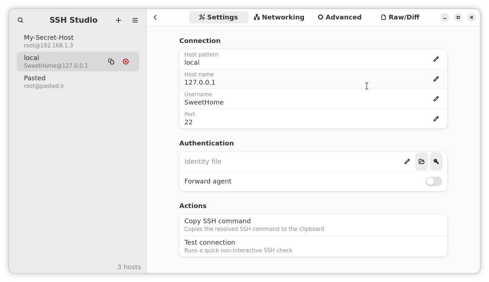

<div align="center">

  

  <h1>SSH-Studio</h1>

  
  
  
  

  <p>A native <strong>GTK4 desktop app</strong> for editing and validating your <code>~/.ssh/config</code>.</p>
  <p>Search, edit, and validate SSH hosts with a clean UI — no need to touch terminal editors.</p>

</div>

---

## Preview

<div align="center">
  
  
</div>

---

## Features

- **Visual host editor** – Edit common fields (Host, HostName, User, Port, IdentityFile, ForwardAgent, etc.).
- **Inline validation** – Field-level errors shown directly under inputs; parser checks for duplicates and invalid ports.
- **Search and filter** – Quickly find hosts across aliases, hostnames, users, and identities.
- **Raw/Diff view** – Edit raw `ssh_config` text with instant diff highlighting.
- **Quick actions** – Copy SSH command, test connection, and revert changes.
- **SSH Key Management** – Import, generate, and use your keys without leaving the app.
- **Safe saves** – Automatic backups (configurable), atomic writes, and include support.
- **Keyboard & mouse friendly** – Smooth GTK 4 UI with dark theme preference.
- **Translations** – Ready for localization (gettext support via `po/`).

---

## Install

### From AUR
You can install SSH Studio from AUR [here](https://aur.archlinux.org/packages/ssh-studio).

### From Flathub
[](https://flathub.org/en/apps/io.github.BuddySirJava.SSH-Studio)

### Build from source
You can build and run with GNOME Builder or `flatpak-builder`:

```bash
flatpak-builder --user --force-clean --install-deps-from=flathub build-dir io.github.BuddySirJava.SSH-Studio.json --install

# Run
flatpak run io.github.BuddySirJava.SSH-Studio
```

---

## Project structure

- `src/ssh_config_parser.py` → Parse/validate/generate SSH config safely.
- `src/ui/` → Main App Components (`MainWindow`, `HostList`, `HostEditor`, `SearchBar`, `PreferencesDialog`, `TestConnectionDialog`, `SSH Key Manager`).
- `data/ui/*.ui` → GTK Builder UI blueprints.
- `data/ssh-studio.gresource.xml` → GResource manifest.
- `data/media/` → App icon and screenshots.
- `src/main.py` → Application entry point.
- `meson.build`, `data/meson.build`, `src/meson.build` → Build and install rules.
- `io.github.BuddySirJava.SSH-Studio.json` → Flatpak manifest.
- `po/` → Translations.

---

## Development

Requirements:
- **Python 3.12+**
- **GTK 4 / libadwaita 1.4+**
- **Meson & Ninja**
- **Flatpak / flatpak-builder**

Clone and run in dev mode:

```bash
git clone https://github.com/BuddySirJava/SSH-Studio.git
cd SSH-Studio
meson setup builddir
meson compile -C builddir
./builddir/src/ssh-studio
```

---

## Contributing

Contributions are welcome!  
- Report bugs or request features in the [issue tracker](https://github.com/BuddySirJava/SSH-Studio/issues).  
- Submit pull requests with improvements, translations, or new features.  
- Follow [GNOME HIG](https://developer.gnome.org/hig/) for UI changes.  

---

## License

This project is licensed under the **GNU GPLv3**.  
See [LICENSE](LICENSE) for details.

---

## Support & Contact

- [Open an issue](https://github.com/BuddySirJava/SSH-Studio/issues) on GitHub.  
- Check [Flathub page](https://flathub.org/en/apps/io.github.BuddySirJava.SSH-Studio).  

## Troubleshooting Flatpak Sandbox

If “Test SSH Connection” still fails, grant the sandbox the Flatpak talk permission:

```bash
flatpak override --user --talk-name=org.freedesktop.Flatpak com.buddysirjava.ssh-studio
flatpak run com.buddysirjava.ssh-studio
```

3. Save the file.
---

## 5. Verify the Fix

1. **Rebuild & reinstall** with your updated manifest:  
   ```bash
   flatpak-builder \
     --user \
     --install \
     --force-clean \
     build-dir \
     com.buddysirjava.ssh-studio.json
```
```
flatpak run com.buddysirjava.ssh-studio```

## Using flatpak app id to try and fix the issue

```bash
flatpak list
```
as an example you use vscode to run these
```bash
flatpak override --user --talk-name=org.freedesktop.Flatpak com.visualstudio.code 
```
now run the code.