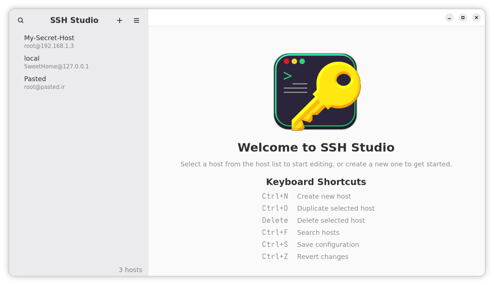

<div align="center">

  

  <h1>
    SSH-Studio
  </h1>

  
  
  

  <p>A native <strong>GTK4 desktop app</strong> for editing and validating your <code>~/.ssh/config</code>.</p>
  <p>Search, edit, and validate SSH hosts with a clean UI — no need to touch terminal editors.</p>

</div>

### Preview

<div align="center">
  
  
</div>

### Features

- **Visual host editor**: Edit common fields (Host, HostName, User, Port, IdentityFile, ForwardAgent, etc.).
- **Inline validation**: Field-level errors are shown directly under inputs; parser checks for duplicate aliases and invalid ports.
- **Search and filter**: Quickly find hosts across aliases, hostnames, users, and identities.
- **Raw/Diff view**: Edit raw `ssh_config` text with instant diff highlighting.
- **Quick actions**: Copy SSH command, test connection, and revert changes.
- **SSH Key Management**: Easily import, generate and use your Public/Private keys.
- **Safe saves**: Automatic backups (configurable), atomic writes, and include support.
- **Keyboard- and mouse-friendly**: Smooth GTK 4 UI, dark theme preference.


## Install

### Build from source
You can clone and run from GNOME Builder.

### Build (Flatpak)

If you prefer Flatpak, use the manifest to build the project.

```bash
flatpak-builder --user --force-clean --install-deps-from=flathub build-dir io.github.BuddySirJava.SSHStudio.json --install

# Run
flatpak run io.github.BuddySirJava.SSHStudio
```

### Usage

1. The app loads `~/.ssh/config` by default. Use the menu → Preferences to choose a different config file or backup directory.
2. Click “+” to add a new host or select a host to edit.
3. Use the Raw/Diff tab for low-level edits; changes are highlighted before saving.
4. Click Save to write changes. A backup can be created automatically (configurable).

### Project structure (high-level)

- `src/ssh_config_parser.py`: Parse/validate/generate SSH config safely.
- `src/ui/`: Adw widgets (`MainWindow`, `HostList`, `HostEditor`, `SearchBar`, `PreferencesDialog`, `TestConnectionDialog`, `SSH Key Manager`).
- `data/ui/*.ui`: GTK Builder UI blueprints.
- `data/ssh-studio.gresource.xml`: GResource manifest.
- `data/media/`: App icon and screenshots.
- `src/main.py`: Application entry point.
- `meson.build`, `data/meson.build`, `src/meson.build`: Build and install rules.
- `io.github.BuddySirJava.SSHStudio.json`: Flatpak manifest.
- `po/`: Translations.

### Known issues
- When editng config using Raw/Diff, custom options added manualy wont appear on Advanced page.
- Show/Hide Host editor button icon might not load. 

### Support

- Open an issue on GitHub: `